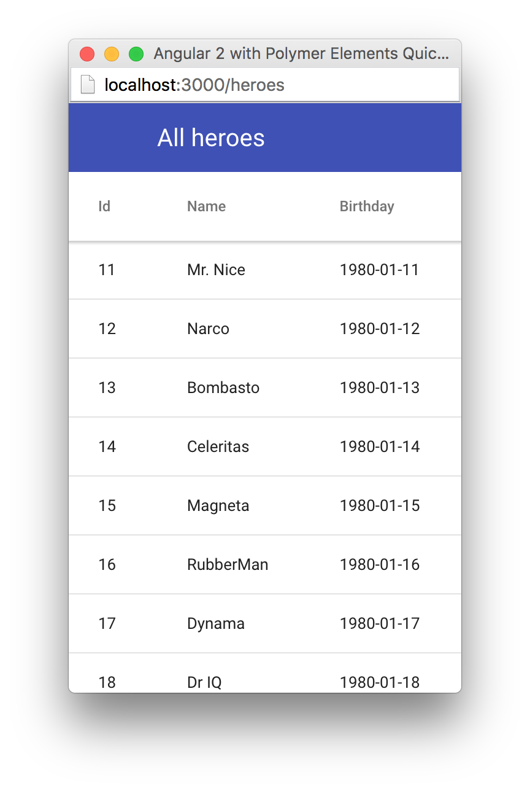
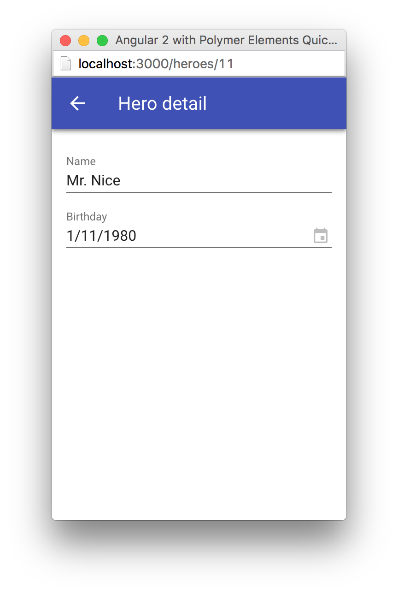

[[vaadin-angular2-polymer.tutorial]]
= Angular 2 with Polymer Elements Tutorial

[[vaadin-angular2-polymer.tutorial.introduction]]
== Introduction

TODO: Link the resulting application code repository in this section when it gets published.

This tutorial explains how to use Polymer elements in Angular 2 applications with the help of the [literal]`https://github.com/vaadin/angular2-polymer[@vaadin/angular2-polymer]` directives.

For this purpose we are going to create a staff management application similar to the https://angular.io/docs/ts/latest/tutorial/[Tour of Heroes] example. But unlike in the Angular 2 Tour of Heroes, instead of implementing the UI elements in place, we’ll use the ready-made UI elements that are built on top of the Web Components technology stack. The resulting application will have a nice-looking mobile-first Material designed UI.

=== The Start Point

This tutorial is based on the https://angular.io/docs/ts/latest/quickstart.html[Angular 2 5 min QuickStart] and the https://angular.io/docs/ts/latest/tutorial/[Angular 2 Tour of Heroes]. We are going to start from the empty application source from the https://angular.io/docs/ts/latest/quickstart.html[QuickStart repository].

If you are not yet familiar with Angular 2, please walk through the Angular 2 QuickStart and the Tour of Heroes first. In this tutorial we are going to skip the explanations that are already given in Angular 2 tutorials.

=== The End Result

In our heroes management application there will be two UI screens. This is the first screen with the list of all heroes made with Vaadin Grid of https://vaadin.com/elements[Vaadin Elements]:

[[figure.vaadin-angular2-polymer.tutorial.result-heroes-list]]
.A Screenshot of the List of Heroes

By clicking on a grid row, the user can open the the hero detail editor screen. It is made using Paper Input and Vaadin DatePicker:

[[figure.vaadin-angular2-polymer.tutorial.result-hero-detail]]
.A Screenshot of Hero Detail View

Both screens have a context-sensitive toolbar at the top, containing the title and the optional back icon button.

[[vaadin-angular2-polymer.tutorial.creating-project]]
== Creating Project

This tutorial is based on the Angular 2 QuickStart TypeScript source code. In this step, we create a new project on top of the QuickStart source code.

[NOTE]
====
If you are not yet familiar with Angular 2, please go through the https://angular.io/docs/ts/latest/quickstart.html[Angular 2 QuickStart] tutorial, which explains every step of starting a new Angular 2 application from scratch.
====

=== Starting from the QuickStart Repository

Clone the https://github.com/angular/quickstart[QuickStart repository] into the tutorial project folder:

[subs="normal"]
----
[prompt]#$# [command]#git# clone https://github.com/angular/quickstart my-project
[prompt]#$# [command]#cd# my-project
----

We are not going to contribute to the quickstart repository itself, so the original repository data is not needed. Remove the git repository data folder:

[subs="normal"]
----
[prompt]#$# [command]#rm# -rf .git
----

=== Starting from the QuickStart ZIP Package

Alternatively, instead of using git to clone the QuickStart repository, you can download and extract the https://github.com/angular/quickstart/archive/master.zip[QuickStart zip package].

=== Remove the AppComponent Tests

The QuickStart respository contains tests for [classname]#AppComponent#. Unfortunately, some changes to [classname]#AppComponent# in the following steps are going to break the compilation for these tests.

Please remove the [filename]#app/app.component.spec.ts# file to prevent its compilation errors introduced later in this tutorial.

[NOTE]
.Testing in Angular 2
====
Testing is out of the scope of this tutorial.

See the https://angular.io/docs/ts/latest/guide/testing.html[Testing chapter] in the Angular 2 Developer Guide for more information on the topic.
====

=== Installing Npm Packages and Starting the Development Server

Install npm dependencies:

[subs="normal"]
----
[prompt]#$# [command]#npm# install
----

At this point you should be able to compile TypeScript source code and launch the development server. Let’s start the server to verify:

[subs="normal"]
----
[prompt]#$# [command]#npm# start
----

Press `Ctrl+C` to stop the development server.

[TIP]
====
See the https://github.com/angular/quickstart/blob/master/README.md[QuickStart README] for more information about creating a new project and other useful [command]#npm# commands.
====

[[vaadin-angular2-polymer.tutorial.dependencies]]
== Adding and Installing Dependencies

After the previous step, we have an empty Angular 2 application source with all the Angular dependencies installed. In this step, we are going to add the Polymer library and some elements as dependencies of our application, and install them.

Vaadin Elements and other Polymer elements are mainly distributed through http://bower.io/[Bower]. We are going to use Bower to declare these dependencies and install them.

=== Adding Bower Dependencies

[IMPORTANT]
====
You should install Bower before we start using it. Use [command]#npm# to install Bower with this command:

[subs="normal"]
----
[prompt]#$# [command]#npm# install -g bower
----
====

Create [filename]#bower.json# file in your project root with the following contents:

[source,json]
.bower.json
----
{
  "name": "my-project",
  "description": "",
  "main": "",
  "authors": [
    "Your Name"
  ],
  "license": "ISC",
  "homepage": "",
  "private": true,
  "ignore": [
    "**/.*",
    "node_modules",
    "bower_components",
    "test"
  ],
  "dependencies": {
    "polymer": "Polymer/polymer#^1.4.0",
    "iron-flex-layout": "PolymerElements/iron-flex-layout#^1.3.1",
    "iron-icons": "PolymerElements/iron-icons#^1.1.3",
    "app-layout": "PolymerElements/app-layout#^0.9.0",
    "paper-styles": "PolymerElements/paper-styles#^1.1.4",
    "paper-icon-button": "PolymerElements/paper-icon-button#^1.1.1",
    "paper-input": "PolymerElements/paper-input#^1.1.11",
    "vaadin-grid": "Vaadin/vaadin-grid#^1.1.0",
    "vaadin-date-picker": "Vaadin/vaadin-date-picker#^1.1.0"
  }
}
----

This file declares all bower dependencies for our application. Now install them with this command:

[subs="normal"]
----
[prompt]#$# [command]#bower# install
----

After that, in your project root you should have the [filename]#bower_components# directory with all elements declared in the [filename]#bower.json#, together with the elements’ requirements. List the contents of the [filename]#bower_components# directory to verify that, it should contain these subdirectories:

.Contents of the bower_components Directory
----
app-layout
font-roboto
iron-a11y-announcer
iron-a11y-keys-behavior
iron-autogrow-textarea
iron-behaviors
iron-checked-element-behavior
iron-dropdown
iron-fit-behavior
iron-flex-layout
iron-form-element-behavior
iron-icon
iron-icons
iron-iconset-svg
iron-input
iron-media-query
iron-meta
iron-overlay-behavior
iron-resizable-behavior
iron-scroll-target-behavior
iron-selector
iron-validatable-behavior
neon-animation
paper-behaviors
paper-button
paper-icon-button
paper-input
paper-material
paper-ripple
paper-styles
polymer
vaadin-date-picker
vaadin-grid
web-animations-js
webcomponentsjs
----

[TIP]
.Add bower_components to .gitignore
====
It is ususally a good practice to exclude external dependencies from your source control. Angular 2 QuickStart source code already contains a [filename]#.gitignore# file, which excludes [filename]#node_modules# directory with npm dependencies from git repository of your application.

Please add the following line to the [filename]#.gitignore# file to also prevent bower dependencies from being tracked by your source control:

[source]
----
bower_components
----
====

=== Npm Dependency

Alongside with bower dependencies, we also need to add one npm dependency to the project. `@vaadin/angular2-polymer` package adds support for Polymer elements in Angular 2 component templates. Run this command to install the package and save the dependency in [filename]#package.json# at the same time:

[subs="normal"]
----
[prompt]#$# [command]#npm# install @vaadin/angular2-polymer --save
----

[[vaadin-angular2-polymer.tutorial.polymer]]
== Adding Polymer Elements to Our Application

In the previous step, we downloaded elements to bower_components directory. Now we are going to import these elements in our application.

In your project root, edit the [filename]#index.html# file and replace the contents with these lines:

[source,html]
----
<!DOCTYPE html>
<html>
  <head>
    <title>Angular 2 with Polymer Elements QuickStart</title>
    <meta charset="UTF-8">
    <meta name="viewport" content="width=device-width, initial-scale=1">

    <!-- Polyfills -->
    
    

    <!-- JavaScript libraries -->
    
    
    

    <!-- Styles -->
    <link rel="import" href="bower_components/iron-flex-layout/iron-flex-layout.html">
    <link rel="import" href="bower_components/paper-styles/color.html">
    <link rel="import" href="bower_components/paper-styles/default-theme.html">
    <link rel="import" href="bower_components/paper-styles/typography.html">
    <link rel="import" href="bower_components/paper-styles/shadow.html">
    

    <!-- Polymer Elements -->
    <link rel="import" href="bower_components/iron-icons/iron-icons.html">
    <link rel="import" href="bower_components/app-layout/app-layout.html">
    <link rel="import" href="bower_components/paper-icon-button/paper-icon-button.html">
    <link rel="import" href="bower_components/paper-input/paper-input.html">
    <link rel="import" href="bower_components/vaadin-grid/vaadin-grid.html">
    <link rel="import" href="bower_components/vaadin-date-picker/vaadin-date-picker.html">

    <!-- SystemJS Configuration -->
    
    
  </head>

  <body>
    <my-app>Loading...</my-app>
  </body>
</html>
----

Here’s the list of important changes explained:

The Doctype Declaration::
We added the `<!DOCTYPE html>` declaration in the first line of the HTML file. It switches document to use Standards mode, as required by the internals of [vaadinelement]#vaadin-grid#.

The Web Components Polyfill::
The technology stack behind Web Components (namely, HTML Imports, Shadow DOM and Custom Elements) is not yet natively supported in all browses. Therefore we added the [filename]#webcomponents-lite.min.js# polyfill.

Importing Polymer Elements::
We added imports of Polymer elements that we are going to use in our application to the head section of the [filename]#index.html# file.

SystemJS App Import Change::
In some browsers, HTML Imports are loaded asynchronously. But we need them to be completely loaded before we import our Angular application. Hence we wrapped `System.import('app')...` call in the listener callback of the [eventname]#WebComponentsReady# event, which is fired by the polyfill after all imports are loaded and elements have been registered.
+
[IMPORTANT]
.Load Order
====
The order of loading Polymer elements and the rest of the Angular application code does matter. It is required to have Polymer elements loaded and registered before importing the Angular application. `@vaadin/angular2-polymer` package strictly depends on that.
====

Style Changes::
Polymer elements come with nice builtin styles in the way of Material Design. Angular 2 also provides style encapsulation mechanisms for our application components.
+
So the global styles are not needed anymore. Therefore we removed the [filename]#styles.css# external stylesheet and replaced it with [elementname]#iron-flex-layout# and [elementname]#paper-styles# style mixins imports and one embedded global style rule for body.
+
The body style is the only global style that remains in our application. We need it to stretch the body container to occupy full height of the browser viewport, and also to specity default font styles and line height, default background and text colors.
+
[TIP]
====
Instead of figuring out the exact rules and values for the body style, here we import and reuse CSS mixins and CSS custom properties declared in [elementname]#iron-flex-layout# and [elementname]#paper-styles#.
====
+
[IMPORTANT]
====
When using custom CSS mixins and custom CSS properties in your main document styles, wrap your styles inside a `` tag.

See the https://www.polymer-project.org/1.0/docs/devguide/styling.html[Styling section of the Polymer Developer Guide] for more information on styling Polymer elements and the document, custom CSS mixins and properties usage and limitations.
====

Delete the [filename]#styles.css# file from your project directory since it is no longer in use.

[NOTE]
.Duplicated Imports Handling
====
Our HTML imports also import their dependencies. As In the resulting dependency tree there might be multiple imports of the the same file. In this case, the duplicated fetch of the same file is prevented in browsers by checking the file location.

See http://w3c.github.io/webcomponents/spec/imports/#fetching-import[Fetching Import section of the HTML Imports Spec] for more detailed information about the fetching algorithm.
====

[[vaadin-angular2-polymer.tutorial.application-layout]]
== Building the Application Layout with Paper Elements

After the previous step we have some Polymer elements imported in [filename]#index.html# of our application. In this step, we are going to use them to create an application layout with a toolbar in [classname]#AppComponent#.

=== Updating SystemJS Configuration

For using Polymer elements in our Angular components we need to import [classname]#PolymerElement# directives from `@vaadin/angular2-polymer`. Thus we need to make the module loader (SystemJS, in our case) aware of how to load the `@vaadin/angular2-polymer` package.

Angular 2 TypeScript QuickStart contains SystemJS packages import configuration in the [filename]#systemjs.config.js# file in the project root. Please edit this file and add mapping for the `@vaadin` scope and the `@vaadin/angular2-polymer` package there like follows:

[source,javascript]
.systemjs.config.js
----
/**
 * System configuration for Angular 2 samples
 * Adjust as necessary for your application needs.
 */
(function(global) {

  // map tells the System loader where to look for things
  var map = {
    'app':                        'app', // 'dist',

    '@angular':                   'node_modules/@angular',
    'angular2-in-memory-web-api': 'node_modules/angular2-in-memory-web-api',
    'rxjs':                       'node_modules/rxjs',
    '@vaadin':                    'node_modules/@vaadin'
  };

  // packages tells the System loader how to load when no filename and/or no extension
  var packages = {
    'app':                        { main: 'main.js',  defaultExtension: 'js' },
    'rxjs':                       { defaultExtension: 'js' },
    'angular2-in-memory-web-api': { defaultExtension: 'js' },
    '@vaadin/angular2-polymer':   { main: 'index.js', defaultExtension: 'js' }
  };

  var ngPackageNames = [
    'common',
    'compiler',
    'core',
    'http',
    'platform-browser',
    'platform-browser-dynamic',
    'router',
    'router-deprecated',
    'upgrade',
  ];

  // Add package entries for angular packages
  ngPackageNames.forEach(function(pkgName) {
    packages['@angular/'+pkgName] = { main: pkgName + '.umd.js', defaultExtension: 'js' };
  });

  var config = {
    map: map,
    packages: packages
  };

  System.config(config);

})(this);
----

=== AppComponent Changes

Open [filename]#app/app.component.ts# and replace the contents with the following code:

[source,typescript]
.app/app.component.ts
----
import { Component } from '@angular/core';
import { PolymerElement } from '@vaadin/angular2-polymer';

@Component({
  selector: 'my-app',
  template: `
    <app-header-layout has-scrolling-region>
      <app-header fixed>
        <app-toolbar>
          
All heroes

        </app-toolbar>
      </app-header>
      
My application content

    </app-header-layout>
  `,
  styles: [`
    app-toolbar {
      background: var(--primary-color);
      color: var(--dark-theme-text-color);
    }
  `],
  directives: [
    PolymerElement('app-header-layout'),
    PolymerElement('app-header'),
    PolymerElement('app-toolbar')
  ]
})
export class AppComponent { }
----

Save changes and launch the development server to see the results in your browser. After loading, your application should have this look:

[[figure.vaadin-angular2-polymer.tutorial.app-layout]]
.A Screenshot of Empty Application Layout
image::img/app-layout.png[width="432",height="644"]

Now your application has a layout made by using [elementname]#app-header-layout#, [elementname]#app-header# and [elementname]#app-toolbar#.

=== Elements Used in This Step

[elementname]#app-header-layout#:: The application layout consisting of the [elementname]#app-header# and the main contents. In our case, it adds a scrollable container for the application contents as well.

[elementname]#app-header#:: Acts as a header in the application layout. The header is fixed in our application.

[elementname]#app-toolbar#:: Provides a toolbar wrapper.

[NOTE]
.app-layout Elements are Design-Agnostic
====
Polymer elements from [elementname]#app-layout# set, including [elementname]#app-toolbar# that we use, are design-agnostic. They do not enforce have Material Design look by default. Therefore we need to adjust [elementname]#app-toolbar# styles a bit.

Therefore we added color rules for the [elementname]#app-toolbar# in the styles of the [classname]#AppComponent#. We reuse the color values of default theme from [elementname]#paper-styles#.

Apart from the colors, it inherits the font family declared for the body. We have already decleared our font settings for the body in [filename]#index.html# earliear during this step.
====

[IMPORTANT]
.PolymerElement Directives
====
In order to enable all features of Polymer elements used inside your Angular component templates, remember to import [classname]#PolymerElement# in the component file and add `PolymerElement('element-name')` line for each Polymer element you use to the [propertyname]#directives# array of your component metadata.
====

[[vaadin-angular2-polymer.tutorial.list-heroes]]
== List Heroes with Vaadin Grid

In the previous step we added the application layout with [elementname]#app-layout# elements. Next we are going add actual application content. Our plan is to use Vaadin Grid to list Heroes.

[NOTE]
.Some Parts are Explained in the Tour of Heroes
====
This step partly follows the Angular 2 Tour of Heroes Tutorial. Therefore here we skip explaining the parts of the code that are similar in both this tutorial and the Tour of Heroes, like the [classname]#Hero# class and the [classname]#HeroService#.

See https://angular.io/docs/ts/latest/tutorial/[Tour of Heroes] for the detailed explainations of these parts.
====

=== Hero Class

Let us start with creating the [classname]#Hero# class. Add [filename]#app/hero.ts# file with the following contents:

[source,typescript]
.app/hero.ts
----
export class Hero {
  id: number;
  name: string;
  birthday: string; // Using strings for simplicity
}
----

Unlike in Angular 2 Tour of Heroes, in our application we are about to store and expose birthday of each hero for the user. Here we add `birthday: string;` property to our [classname]#Hero# class.

[NOTE]
.Using Strings to Store Dates
====
Why are we using the [classname]#string# type and not [classname]#Date# to store dates? There are two reasons:

. Builtin JavaScript [classname]#Date# type is always stored as a timestamp, so it always contains the exact time information. This is not only redundant, but also harder to use than a plain string in case of storing just a date. It requires extra care about the correct time and timezone when storing the value and displaying it to the user, otherwise we might get incorrect dates because of timezone mismatches.

. `Vaadin DatePicker`, as well as native HTML5 `<input type="date">`, gives the date value as an ISO-formatted [classname]#string#. To keep the simplicity, in our application we also store dates as strings, avoiding conversions.
====

=== Mock Heroes Data

Add [filename]#app/mock-heroes.ts# file with some heroes data:

[source,typescript]
.app/mock-heroes.ts
----
import { Hero } from './hero';

export var HEROES: Hero[] = [
  { "id": 11,  "name": "Mr. Nice",   "birthday": "1980-01-11" },
  { "id": 12,  "name": "Narco",      "birthday": "1980-01-12" },
  { "id": 13,  "name": "Bombasto",   "birthday": "1980-01-13" },
  { "id": 14,  "name": "Celeritas",  "birthday": "1980-01-14" },
  { "id": 15,  "name": "Magneta",    "birthday": "1980-01-15" },
  { "id": 16,  "name": "RubberMan",  "birthday": "1980-01-16" },
  { "id": 17,  "name": "Dynama",     "birthday": "1980-01-17" },
  { "id": 18,  "name": "Dr IQ",      "birthday": "1980-01-18" },
  { "id": 19,  "name": "Magma",      "birthday": "1980-01-19" },
  { "id": 20,  "name": "Tornado",    "birthday": "1980-01-20" }
];
----

=== The Hero Service

We also need a [classname]#HeroService# to be able to retrive the heroes list in our Angular application. Add [filename]#app/hero.service.ts# file:

[source,typescript]
.app/hero.service.ts
----
import { Injectable } from '@angular/core';

import { Hero } from './hero';
import { HEROES } from './mock-heroes';

@Injectable()
export class HeroService {
  getHeroes() {
    return Promise.resolve(HEROES);
  }
}
----

=== Heroes List Component

Add the heroes list component file [filename]#app/heroes.component.ts# with the following code:

[source,typescript]
.app/heroes.component.ts
----
import { Component, OnInit } from '@angular/core';
import { PolymerElement } from '@vaadin/angular2-polymer';

import { Hero } from './hero';
import { HeroService } from './hero.service';

@Component({
  selector: 'my-heroes',
  template: `
    <vaadin-grid [items]="heroes">
      <table>
        <colgroup>
          <col name="id">
          <col name="name">
          <col name="birthday">
        </colgroup>
      </table>
    </vaadin-grid>
  `,
  styles: [`
    vaadin-grid {
      height: 100%;
    }
  `],
  directives: [
    PolymerElement('vaadin-grid')
  ]
})
export class HeroesComponent implements OnInit {
  heroes: Hero[];

  constructor(private _heroService: HeroService) { }

  getHeroes() {
    this._heroService.getHeroes().then(heroes => this.heroes = heroes);
  }

  ngOnInit() {
    this.getHeroes();
  }
}
----

Here in [classname]#HeroesComponent# we have the [elementname]#vaadin-grid# element in the template. In styles, there is a `height: 100%;` rule for [elementname]#vaadin-grid#. In the template, inside [elementname]#vaadin-grid# there are three columns specified with their corresponding item property names.

Also in the template, the [propertyname]#items# property of [elementname]#vaadin-grid# is bound to the [propertyname]#heroes# array property of [classname]#HeroesComponent#. At the same time, we import and use [classname]#HeroService# to get the list of heroes and assign the [propertyname]#heroes# property. Angular component data binding takes care of updating [propertyname]#items# property of [elementname]#vaadin-grid# with the list of heroes for us.

[NOTE]
.PolymerElement Directives
====
Once again, we import [classname]#PolymerElement# in this file and add `PolymerElement('vaadin-grid')` to the [propertyname]#directives# of the component to enable all features for Vaadin Grid Polymer element in our [classname]#HeroesComponent#.
====

=== Displaying Heroes List

Finally in this step, change [filename]#app/app.component.ts# to provide [classname]#HeroService# for our application and display the heroes list component:

[source,typescript]
.app/app.component.ts
----
import { Component } from '@angular/core';
import { PolymerElement } from '@vaadin/angular2-polymer';

import { HeroService } from './hero.service';
import { HeroesComponent } from './heroes.component';

@Component({
  selector: 'my-app',
  template: `
    <app-header-layout has-scrolling-region>
      <app-header fixed>
        <app-toolbar>
          
All heroes

        </app-toolbar>
      </app-header>
      <my-heroes></my-heroes>
    </app-header-layout>
  `,
  styles: [`
    app-toolbar {
      background: var(--primary-color);
      color: var(--dark-theme-text-color);
    }
  `],
  directives: [
    PolymerElement('app-header-layout'),
    PolymerElement('app-header'),
    PolymerElement('app-toolbar'),
    HeroesComponent
  ],
  providers: [
    HeroService
  ]
})
export class AppComponent { }
----

Here is what have changed in [filename]#app/app.component.ts#:

* We import [classname]#HeroService# and list it in [propertyname]#providers#
* We also import [classname]#HeroesComponent#, append it to [propertyname]#directives# and replace `
My application content
` to `<my-heroes></my-heroes>`

Now it’s time to look at the browser window again to the heroes list in our application. Here is how it should look like:

[[figure.vaadin-angular2-polymer.tutorial.heroes-list]]
.A Screenshot of the Application with the List of Heroes

[[vaadin-angular2-polymer.tutorial.hero-editor]]
== Hero Editor and Routing

Previously we added the heroes list in our application. In this step, we are going to add the editing feature. After that, the user should be able to navigate to the hero details by clicking a row in the heroes list, edit the details and get back to the list with the back button in the toolbar.

[NOTE]
.Some Parts are Explained in the Tour of Heroes
====
This step partly follows the Angular 2 Tour of Heroes Tutorial. Therefore here we skip explaining the parts of the code that are similar in both this tutorial and the Tour of Heroes, like the routing requirements and configuration.

See https://angular.io/docs/ts/latest/tutorial/[Tour of Heroes] for the detailed explainations of the similar parts.
====

=== Add the Hero Get Method to the Service

Let us add the [methodname]#getHero(id: number)# method to the [classname]#HeroService#, that would be used to retrive a single hero in our application components. Open the [filename]#app/hero.service.ts# file and change its contents to the following code:

[source,typescript]
.app/hero.service.ts
----
import { Injectable } from '@angular/core';

import { Hero } from './hero';
import { HEROES } from './mock-heroes';

@Injectable()
export class HeroService {
  getHeroes() {
    return Promise.resolve(HEROES);
  }

  getHero(id: number) {
    return Promise.resolve(HEROES).then(
      heroes => heroes.filter(hero => hero.id === id)[0]
    );
  }
}
----

=== Add the Hero Editor Component

Create the file [filename]#app/hero-detail.component.ts# and place these lines inside:

[source,typescript]
.app/hero-detail.component.ts
----
import { Component, OnInit } from '@angular/core';
import { RouteParams } from '@angular/router-deprecated';
import { PolymerElement } from '@vaadin/angular2-polymer';

import { Hero } from './hero';
import { HeroService } from './hero.service';

@Component({
  selector: 'my-hero-detail',
  template: `
    

      <paper-input label="Name" [(value)]="hero.name"></paper-input>
      <vaadin-date-picker label="Birthday" [(value)]="hero.birthday"></vaadin-date-picker>
    

  `,
  directives: [
    PolymerElement('paper-input'),
    PolymerElement('vaadin-date-picker')
  ],
  styles: [`
    :host {
      display: block;
      padding: 16px;
    }
  `]
})
export class HeroDetailComponent implements OnInit {
  hero: Hero;

  constructor(
    private _routeParams: RouteParams,
    private _heroService: HeroService
  ) { }

  ngOnInit() {
    let id = +this._routeParams.get('id');
    this._heroService.getHero(id).then(hero => this.hero = hero);
  }
}
----

So, here we have just created [classname]#HeroDetailComponent#, the heroes editor for our application. It uses [elementname]#paper-input# bound to the [propertyname]#hero.name# and Vaadin DatePicker bound to the [propertyname]#hero.birthday# property this time with two-way data binding (i.e. with `[(value)]` syntax).

[classname]#HeroDetailComponent# gets the hero [propertyname]#id# from [classname]#RouteParams# and calls [methodname]#getHero(id: number)# method from [classname]#HeroService# with the hero id argument to retrive the hero object. After the retrieval, the hero object is assigned to the [propertyname]#hero# property of [classname]#HeroDetailComponent#.

Since we use two-way binding, the [propertyname]#hero.name# and the [propertyname]#hero.birthday# subproperty values are automatically displayed in the corresponding elements, and when the user edits these values in the elements, the subproperties of [propertyname]#hero# property are updated automatically.

[IMPORTANT]
.Use ngIf When Loading Content
====
The hero object is retrived asynchronously after the component initialization. At this time when the retrieval starts, the component template is already rendered, but the [propertyname]#hero# i>s not loaded yet, so we can not use [propertyname]#hero.name# and [propertyname]#hero.birthday# subproperties. Using them at this moment would result in errors.

That is why we wrap [elementname]#paper-input# and [elementname]#vaadin-date-picker# elements with `

` in the component template. The `ngIf` structural directive not only hides the content, but also stops the hidden part of the template from being evaluated and rendered. This effectively prevents errors of accessing non-existant subproperties during the loading.
====

Unlike with Vaadin Grid in the heroes list, we don’t want our editor contents to touch the edges of the browser window. It’s nice to have some spacing around them. For that reason we add `display: block;` and `padding: 16px;` rules in the styles section of our component metadata.

=== Add Routing

The Angular 2 Component Router uses `history.pushState` API for navigation. This requires us to declare the base `href` for the main document. Add this line to the [filename]#index.html# file in the project root just after the `<head>` opening tag:

[source,html]
.index.html <head> Section
----
  <base href="/">
----

Next, add routing, the back button and navigation reaction to the [classname]#AppComponent#. Edit [filename]#app/app.component.ts# to contain the code below:

[source,typescript]
.app/app.component.ts
----
import { Component, OnInit } from '@angular/core';
import { RouteConfig, ROUTER_DIRECTIVES, ROUTER_PROVIDERS, Router, RouteData } from '@angular/router-deprecated';
import { PolymerElement } from '@vaadin/angular2-polymer';

import { HeroService } from './hero.service';
import { HeroesComponent } from './heroes.component';
import { HeroDetailComponent } from './hero-detail.component';

@Component({
  selector: 'my-app',
  template: `
    <app-header-layout has-scrolling-region>
      <app-header fixed>
        <app-toolbar [class.raised]="isInChildView">
          <paper-icon-button icon="arrow-back" *ngIf="isInChildView" (click)="goBack()"></paper-icon-button>
          
{{title}}

        </app-toolbar>
      </app-header>
      <router-outlet></router-outlet>
    </app-header-layout>
  `,
  styles: [`
    app-toolbar {
      background: var(--primary-color);
      color: var(--dark-theme-text-color);
    }

    app-toolbar.raised {
      @apply(--shadow-elevation-4dp);
    }

    paper-icon-button {
      position: absolute;
      top: 12px;
      left: 8px;
    }
  `],
  directives: [
    ROUTER_DIRECTIVES,
    PolymerElement('app-header-layout'),
    PolymerElement('app-header'),
    PolymerElement('app-toolbar'),
    PolymerElement('paper-icon-button')
  ],
  providers: [
    ROUTER_PROVIDERS,
    HeroService
  ]
})
@RouteConfig([
  {
    path: '/heroes',
    name: 'Heroes',
    component: HeroesComponent,
    useAsDefault: true,
    data: {
      title: 'All heroes',
      root: true
    }
  },
  {
    path: '/heroes/:id',
    name: 'HeroDetail',
    component: HeroDetailComponent,
    data: {
      title: 'Hero detail'
    }
  }
])
export class AppComponent implements OnInit {
  title = '';
  isInChildView = false;

  constructor(private _router: Router) { }

  ngOnInit() {
    this._router.subscribe(() => {
      let routeData: RouteData = this._router.currentInstruction.component.routeData;
      this.title = routeData.get('title');
      this.isInChildView = !routeData.get('root');
    });
  }

  goBack() {
    this._router.navigate(['Heroes']);
  }
}
----

Now we import [classname]#RouteConfig# decorator and some other Angular 2 Component Router parts. We also add [classname]#HeroDetailComponent# import alongside with [classname]#HeroesComponent#.

As usual with the routing in Angular 2, we add [classname]#ROUTER_DIRECTIVES# to the [propertyname]#directives# array of [classname]#AppComponent# component metadata, as well as [classname]#ROUTER_PROVIDERS# to the [propertyname]#providers# array.

We use [classname]#RouteConfig# decorator to declare routes in our application. There are two routes, one for the heroes list ([classname]#HeroesComponent#), and another for the hero detail editor ([classname]#HeroDetailComponent#).

Note that the first route has `useAsDefault: true;` option in order to open the heroes list by default.

The second route path features the `:id` parameter. It is received inside [classname]#HeroDetailComponent# and used there to retrive the hero object, as described above in this step.

=== Navigation from List to Detail

The last feature to implement in this step is navigation from the heroes list to the hero detail by clicking a row. Open [filename]#app/heroes.component.ts# and change it to contain the following code:

[source,typescript]
.app/heroes.component.ts
----
import { Component, OnInit } from '@angular/core';
import { Router } from '@angular/router-deprecated';
import { PolymerElement } from '@vaadin/angular2-polymer';

import { Hero } from './hero';
import { HeroService } from './hero.service';

@Component({
  selector: 'my-heroes',
  template: `
    <vaadin-grid [items]="heroes" (selected-items-changed)="onSelectedItemsChanged($event)">
      <table>
        <colgroup>
          <col name="id">
          <col name="name">
          <col name="birthday">
        </colgroup>
      </table>
    </vaadin-grid>
  `,
  styles: [`
    vaadin-grid {
      height: 100%;
    }
  `],
  directives: [
    PolymerElement('vaadin-grid')
  ]
})
export class HeroesComponent implements OnInit {
  heroes: Hero[];

  constructor(
    private _router: Router,
    private _heroService: HeroService
  ) { }

  getHeroes() {
    this._heroService.getHeroes().then(heroes => this.heroes = heroes);
  }

  ngOnInit() {
    this.getHeroes();
  }

  goToHeroDetailById(id: number) {
    this._router.navigate(['HeroDetail', { id: id }]);
  }

  onSelectedItemsChanged(event: any) {
    let selectedIndex: number = event.target.selection.selected()[0];
    if (selectedIndex !== undefined) {
      this.goToHeroDetailById(this.heroes[selectedIndex].id);
    }
  }
}
----

Now when the user clicks a row inside the heroes list, [elementname]#vaadin-grid# fires [eventname]#selected-items-changed# event. We bound the event to the [methodname]#onSelectedItemsChanged(event: any)# method of the [classname]#HeroesComponent#. In listener method, we read the selected item index, get the [propertyname]#id# property of the corresponding [propertyname]#heroes# array item and call [methodname]#goToHeroDetailById(id: number)#, which uses [classname]#Router# to navigate to the hero detail of the selected hero.

=== Try It Out

All the changes for this step are done. Now launch your application again and try how the navigation works.

After opening the application, click the first row in the heroes list. You should see the detail view like in the following screenshot:

[[figure.vaadin-angular2-polymer.tutorial.hero-detail]]
.A Screenshot of Hero Detail View

Click the back icon in the toolbar to navigate back to the heroes list. If you made any changes in the hero detail editor, they should be shown in the heroes list right away.

=== Nice Touches in the AppComponent

Here are the UX-related changes to AppComponent explained.

==== Dynamic Toolbar Title

We add the [propertyname]#title# property to the [classname]#AppComponent# and bind it to the text content of `

` inside the toolbar in the template.

Instead of a static title, the title is now updated dynamically. We subscribe to the [classname]#Router# in [classname]#AppComponent# and use [classname]#RouteData# in the navigation event callback to get the title value specified for the current route. Each time after user opens the application or navigates inside, the [classname]#Router# event is dispatched so the [propertyname]#title# property is updated.

==== The Back Icon in the Toolbar

We add [elementname]#paper-icon-button# to have a back icon inside the [elementname]#app-toolbar# in the template. The icon has a click event binding, which calls [methodname]#goBack()# method of [classname]#AppComponent#. In the method, we invoke [methodname]#navigate(linkParams: any[])# method of the [classname]#Router# to navigate back to the heroes list from the hero detail.

When the heroes list is shown, the back icon is useless, so we need to hide it. To achieve that, we added [propertyname]#isInChildView# property to [classname]#AppComponent#, which is updated from the route data in the navigation event callback. In the template we add `*ngIf="isInChildView"` for the [elementname]#paper-icon-button#.

We also add a few positioning style rules for the [elementname]#paper-icon-button#.

==== Dynamic Toolbar Shadow

To make the toolbar look better, we make the application toolbar to have a shadow that is shown only for the hero detail view, but not for the heroes list view. For this purpose we bind the `raised` class of the [elementname]#app-toolbar# to [propertyname]#isInChildView# property and add a style rule which applies the shadow mixin from [elementname]#paper-styles# to the [elementname]#app-toolbar# when it has the `raised` class.

[[vaadin-angular2-polymer.tutorial.wrap-up]]
== Wrap Up

All the tutorial steps are complete. Now you can use all powers of Polymer elements in your Angular 2 applications and know how to do it.

TODO: Link the resulting application code repository in this section when it gets published.

=== Next Steps

There are several ways of improvement for our application. For example, you might want to add an explicit “Save” button to the hero detail editor and make the user able to intentionally submit or discard their changes. To do that, use the `ngForm` directive. See the https://angular.io/docs/ts/latest/guide/forms.html[Forms Chapter] in the Angular 2 Basics guide for the detailed instructions.

In the tutorial, we did not consider the topic of storing your application data. For simplicity, our application uses mock in-memory data and relies on data binding to make temporary changes, that are not saved anywhere. You might want to move the heroes data to a server and add some HTTP API calls in your application. See the Angular 2 https://angular.io/docs/ts/latest/guide/server-communication.html[Http Client] documentation to know how to do that.

Read the https://www.polymer-project.org/1.0/[Polymer Project] website to know about other features that Polymer provides you with. There is also the https://www.polymer-project.org/1.0/start/[Getting Started] guide, where you can learn how to create your own elements and apps based on Polymer.

Don’t forget to find out other elements you can use for building your applications on the https://vaadin.com/elements[Vaadin Elements] page and in the https://elements.polymer-project.org/[Polymer Catalog].
