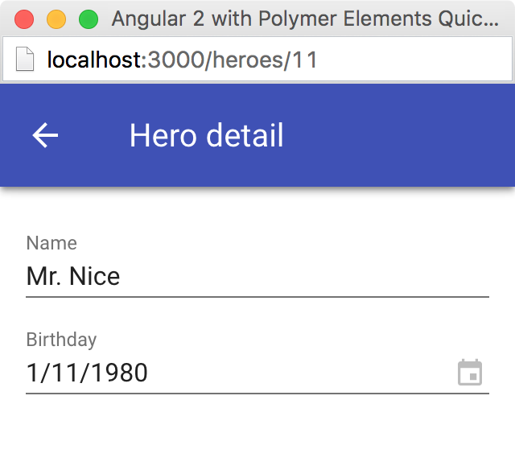

[[vaadin-angular2-polymer.tutorial.hero-editor]]
== Hero Editor and Routing

Previously we added the heroes list in our application. In this step, we are going to add the editing feature. After that, the user should be able to navigate to the hero details by clicking a row in the heroes list, edit the details, and get back to the list with the back button in the toolbar.

[NOTE]
.Some Parts are Explained in the Tour of Heroes
====
This step partly follows the Angular 2 Tour of Heroes Tutorial. Therefore, we skip explaining the parts of the code that are similar both in this tutorial and in the Tour of Heroes, such as the routing requirements and configuration.

See https://angular.io/docs/ts/latest/tutorial/[Tour of Heroes] for a detailed explaination of the similar parts.
====

=== Add the Hero Get Method to the Service

Let us add a [methodname]#getHero(id: number)# method to the [classname]#HeroService#. It can be used to retrive a single hero in our application components. Open the [filename]#app/hero.service.ts# file and change its contents to the following code:

[source,typescript]
.[filename]#app/hero.service.ts#
----
import { Injectable } from '@angular/core';

import { Hero } from './hero';
import { HEROES } from './mock-heroes';

@Injectable()
export class HeroService {
  getHeroes() {
    return Promise.resolve(HEROES);
  }

  getHero(id: number) {
    return Promise.resolve(HEROES).then(
      heroes => heroes.filter(hero => hero.id === id)[0]
    );
  }
}
----

=== Add the Hero Editor Component

Create a file named [filename]#app/hero-detail.component.ts# and put the following lines in it:

[source,typescript]
.[filename]#app/hero-detail.component.ts#
----
import { Component, OnInit } from '@angular/core';
import { ActivatedRoute } from '@angular/router';
import { Subscription } from 'rxjs/Subscription';

import { Hero } from './hero';
import { HeroService } from './hero.service';

@Component({
  selector: 'my-hero-detail',
  template: `
    

      <paper-input label="Name" [(value)]="hero.name"></paper-input>
      <vaadin-date-picker label="Birthday" [(value)]="hero.birthday"></vaadin-date-picker>
    

  `,
  styles: [`
    :host {
      display: block;
      padding: 16px;
    }
  `]
})
export class HeroDetailComponent implements OnInit {
  hero: Hero;
  private _routeParamsSubscription: Subscription;

  constructor(
    private _route: ActivatedRoute,
    private _heroService: HeroService
  ) { }

  ngOnInit() {
    this._routeParamsSubscription = this._route.params.subscribe(params => {
      let id = +params['id']; // (+) converts string 'id' to a number
      this._heroService.getHero(id).then(hero => this.hero = hero);
    });
  }

  ngOnDestroy() {
    this._routeParamsSubscription.unsubscribe();
  }
}
----

So, here we have just created [classname]#HeroDetailComponent#, the heroes editor for our application. It uses [elementname]#paper-input# bound to the [propertyname]#hero.name# and [vaadinelement]#vaadin-date-picker# bound to the [propertyname]#hero.birthday# property through two-way data binding in both cases (that is, with the `[(value)]` syntax).

[classname]#HeroDetailComponent# gets the hero ID from the [classname]#ActivatedRoute# params and calls [methodname]#getHero(id: number)# method from [classname]#HeroService# with the hero ID argument to retrive the hero object. After the retrieval, the hero object is assigned to the [propertyname]#hero# property of [classname]#HeroDetailComponent#.

Since we use two-way binding, the [propertyname]#hero.name# and the [propertyname]#hero.birthday# sub-property values are automatically displayed in the corresponding elements. When the user edits these values in the elements, the sub-properties of the [propertyname]#hero# property are updated automatically.

[IMPORTANT]
.Use ngIf When Loading Content
====
The hero object is retrived asynchronously after the component initialization. At this time when the retrieval starts, the component template is already rendered, but the [propertyname]#hero# is not loaded yet, so we can not use [propertyname]#hero.name# and [propertyname]#hero.birthday# sub-properties. Using them at this time would result in errors.

That is why we wrap the [elementname]#paper-input# and the [vaadinelement]#vaadin-date-picker# elements with `

` in the component template. The `ngIf` structural directive not only hides the content, but also stops the hidden part of the template from being evaluated and rendered. This effectively prevents errors of accessing non-existant sub-properties during the loading.
====

Unlike with Vaadin Grid in the heroes list, we do not want our editor contents to touch the edges of the browser window. It is nice to have some spacing around them. For that reason, we add `display: block;` and `padding: 16px;` rules in the styles section of our component metadata.

=== Add Routing

The Angular 2 Component Router uses `history.pushState` API for navigation. This requires us to declare the base `href` for the main document. Add this line to the [filename]#index.html# file in the project root just after the [elementname]#head# opening tag:

[source,html]
.[filename]#index.html#
----
...
<head>
  <base href="/">
  ...
</head>
...
----

Next we create a router configuration file. Add [filename]#app/app.routing.ts# with the following contents:

[source,typescript]
.[filename]#app/app.routing.ts#
----
import { Routes, RouterModule } from '@angular/router';

import { HeroesComponent } from './heroes.component';
import { HeroDetailComponent } from './hero-detail.component';

const appRoutes: Routes = [
  {
    path: '',
    redirectTo: '/heroes',
    pathMatch: 'full',
  },
  {
    path: 'heroes',
    children: [
      {
        path: '',
        component: HeroesComponent,
        data: {
          title: 'All heroes',
          root: true
        }
      },
      {
        path: ':id',
        component: HeroDetailComponent,
        data: {
          title: 'Hero detail'
        }
      }
    ]
  }
];

export const appRoutingProviders: any[] = [

];

export const routing = RouterModule.forRoot(appRoutes);
----

The routes list starts with the default route, which corresponds to the empty path. This route is used when no path is specified, and in our configuration, it redirects users to the `/heroes` path to open the heroes list by default.

After that in our routing configuration, there are two routes grouped as children under the `/heroes` path: one route is for the heroes list ([classname]#HeroesComponent#) and another is for the hero detail editor ([classname]#HeroDetailComponent#). Note, that the second route path features the `:id` parameter. It is received inside [classname]#HeroDetailComponent# and used there to retrive the hero object, as described above in this step.

Next, add a router outlet, the back button, and the navigation reaction to the [classname]#AppComponent#. Edit [filename]#app/app.component.ts# to contain the code below:

[source,typescript]
.[filename]#app/app.component.ts#
----
import { Component, OnInit } from '@angular/core';
import { ActivatedRoute, Router, NavigationEnd } from '@angular/router';
import { Subscription } from 'rxjs/Subscription';

@Component({
  selector: 'my-app',
  template: `
    <app-header-layout has-scrolling-region>
      <app-header fixed>
        <app-toolbar [class.raised]="isInChildView">
          <paper-icon-button icon="arrow-back" *ngIf="isInChildView" (click)="goBack()"></paper-icon-button>
          
{{title}}

        </app-toolbar>
      </app-header>
      <router-outlet></router-outlet>
    </app-header-layout>
  `,
  styles: [`
    app-toolbar {
      background: var(--primary-color);
      color: var(--dark-theme-text-color);
    }

    app-toolbar.raised {
      @apply(--shadow-elevation-4dp);
    }

    paper-icon-button {
      position: absolute;
      top: 12px;
      left: 8px;
    }
  `]
})
export class AppComponent implements OnInit {
  title = '';
  isInChildView = false;
  private _routerSubscription: Subscription;

  constructor(private _route: ActivatedRoute,
              private _router: Router) { }

  ngOnInit() {
    this._routerSubscription = this._router.events.subscribe(event => {
      if (event instanceof NavigationEnd) {
        let route = this._route.snapshot;
        while (route.firstChild) {
          route = route.firstChild;
        }
        this.title = route.data['title'];
        this.isInChildView = !route.data['root'];
      }
    });
  }

  ngOnDestroy() {
    this._routerSubscription.unsubscribe();
  }

  goBack() {
    this._router.navigate(['/heroes']);
  }
}
----

Then we need to update the [classname]#AppModule#, to import and enable the hero detail editor and the routing configuration. Change the [filename]#app/app.module.ts# file contents as follows:

[source,TypeScript]
.[filename]#app/app.module.ts#
----
import { NgModule, CUSTOM_ELEMENTS_SCHEMA } from '@angular/core';
import { BrowserModule } from '@angular/platform-browser';
import { PolymerElement } from '@vaadin/angular2-polymer';

import { AppComponent }  from './app.component';
import { HeroService } from './hero.service';
import { HeroesComponent } from './heroes.component';
import { HeroDetailComponent } from './hero-detail.component';
import { routing, appRoutingProviders } from './app.routing';

@NgModule({
  imports: [
    BrowserModule,
    routing
  ],
  declarations: [
    AppComponent,
    PolymerElement('app-header-layout'),
    PolymerElement('app-header'),
    PolymerElement('app-toolbar'),
    PolymerElement('paper-icon-button'),
    HeroesComponent,
    PolymerElement('vaadin-grid'),
    HeroDetailComponent,
    PolymerElement('paper-input'),
    PolymerElement('vaadin-date-picker')
  ],
  providers: [
    HeroService,
    appRoutingProviders
  ],
  bootstrap: [ AppComponent ],
  schemas: [ CUSTOM_ELEMENTS_SCHEMA ]
})
export class AppModule { }
----

=== Navigation to the Hero Details

The last feature to implement in this step is navigation from the heroes list to the hero details. Open [filename]#app/heroes.component.ts# and change it to contain the following code:

[source,typescript]
.[filename]#app/heroes.component.ts#
----
import { Component, OnInit } from '@angular/core';
import { Router } from '@angular/router';

import { Hero } from './hero';
import { HeroService } from './hero.service';

@Component({
  selector: 'my-heroes',
  template: `
    <vaadin-grid [items]="heroes" (selected-items-changed)="onSelectedItemsChanged($event)">
      <table>
        <colgroup>
          <col name="id">
          <col name="name">
          <col name="birthday">
        </colgroup>
      </table>
    </vaadin-grid>
  `,
  styles: [`
    vaadin-grid {
      height: 100%;
    }
  `]
})
export class HeroesComponent implements OnInit {
  heroes: Hero[];

  constructor(
    private _router: Router,
    private _heroService: HeroService
  ) { }

  getHeroes() {
    this._heroService.getHeroes().then(heroes => this.heroes = heroes);
  }

  ngOnInit() {
    this.getHeroes();
  }

  onSelect(hero: Hero) {
    this._router.navigate(['/heroes', hero.id]);
  }

  onSelectedItemsChanged(event: any) {
    let selectedIndex: number = event.target.selection.selected()[0];
    if (selectedIndex !== undefined) {
      this.onSelect(this.heroes[selectedIndex]);
    }
  }
}
----

Now when the user clicks a row inside the heroes list, [vaadinelement]#vaadin-grid# fires [eventname]#selected-items-changed# event. We bound the event to the [methodname]#onSelectedItemsChanged(event: any)# method of the [classname]#HeroesComponent#. In the listener method, we read the selected item index, find the selected [propertyname]#heroes# array item, and call [methodname]#onSelect(hero: Hero)#, which uses [classname]#Router# to navigate to the hero detail editor for the selected hero.

=== Try It Out

All the changes for this step are done. Now launch your application again and try how the navigation works.

After opening the application, click the first row in the heroes list. You should see the details view like in the following screenshot:

[[figure.vaadin-angular2-polymer.tutorial.hero-detail]]
.The hero detail view

Click the back icon in the toolbar to navigate back to the heroes list. If you made any changes in the hero detail editor, they should be shown in the heroes list right away.

=== Nice Touches in the AppComponent

In the folllowing, we go through and explain all the UX-related changes that were made to the [classname]#AppComponent# class earlier.

==== Dynamic Toolbar Title

We added the [propertyname]#title# property to the [classname]#AppComponent# and bound it to the text content of `

` inside the toolbar in the template.

Instead of a static title, the title is now updated dynamically. We subscribed to the [classname]#Router# events in [classname]#AppComponent# and used route data in the navigation event callback to get the title value specified for the current route. Each time after user opens the application or navigates inside, the [classname]#Router# [eventname]#NavigationEnd# event is dispatched, so that the [propertyname]#title# property will be updated.

==== The Back Icon in the Toolbar

We added [elementname]#paper-icon-button# to have a back icon inside the [elementname]#app-toolbar# in the template. The icon has a click event binding, which calls the [methodname]#goBack()# method of the [classname]#AppComponent# class. In the method, we invoke the [methodname]#navigate# method of the [classname]#Router# to navigate back to the heroes list from the hero details.

When the heroes list is shown, the back icon is useless, so we need to hide it. To achieve that, we added [propertyname]#isInChildView# property to [classname]#AppComponent#, which is updated from the route data in the navigation event callback. In the template, we added `*ngIf="isInChildView"` for the [elementname]#paper-icon-button#.

We also added a few positioning style rules for the [elementname]#paper-icon-button#.

==== Dynamic Toolbar Shadow

To make the toolbar look better, we made the application toolbar to have a shadow that is shown only for the hero detail view, but not for the heroes list view. For this purpose, we bound the `raised` class of the [elementname]#app-toolbar# to [propertyname]#isInChildView# property and added a style rule which applies the shadow mixin from [elementname]#paper-styles# to the [elementname]#app-toolbar# when it has the `raised` class.

