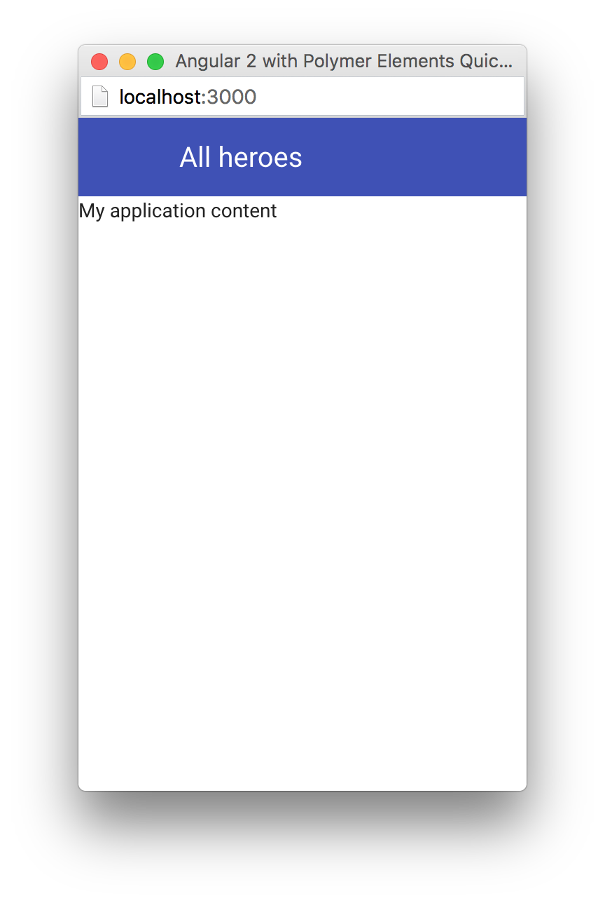

[[vaadin-angular2-polymer.tutorial.layout]]
== Building the Application Layout with Paper Elements

After the previous step, we have some Polymer elements imported in the [filename]#index.html# file of our application. In this step, we are going to use them to create an application layout with a toolbar in [classname]#AppComponent#.

=== Updating SystemJS Configuration

For using Polymer elements in our Angular components, we need to import the [classname]#PolymerElement# directives from `@vaadin/angular2-polymer`. Therefore, we need to make the module loader (SystemJS, in our case) aware of how to load the `@vaadin/angular2-polymer` package.

Angular 2 TypeScript QuickStart contains the SystemJS configuration in the [filename]#systemjs.config.js# file in the project root. Please edit this file and add a mapping for the `@vaadin` scope and the `@vaadin/angular2-polymer` package there as follows:

[source,javascript]
.[filename]#systemjs.config.js#
----
/**
 * System configuration for Angular 2 samples
 * Adjust as necessary for your application needs.
 */
(function(global) {

  // map tells the System loader where to look for things
  var map = {
    'app':                        'app', // 'dist',

    '@angular':                   'node_modules/@angular',
    'angular2-in-memory-web-api': 'node_modules/angular2-in-memory-web-api',
    'rxjs':                       'node_modules/rxjs',
    '@vaadin':                    'node_modules/@vaadin'
  };

  // packages tells the System loader how to load when no filename and/or no extension
  var packages = {
    'app':                        { main: 'main.js',  defaultExtension: 'js' },
    'rxjs':                       { defaultExtension: 'js' },
    'angular2-in-memory-web-api': { defaultExtension: 'js' },
    '@vaadin/angular2-polymer':   { main: 'index.js', defaultExtension: 'js' }
  };

  var ngPackageNames = [
    'common',
    'compiler',
    'core',
    'http',
    'platform-browser',
    'platform-browser-dynamic',
    'router',
    'router-deprecated',
    'upgrade',
  ];

  // Add package entries for angular packages
  ngPackageNames.forEach(function(pkgName) {
    packages['@angular/'+pkgName] = { main: pkgName + '.umd.js', defaultExtension: 'js' };
  });

  var config = {
    map: map,
    packages: packages
  };

  System.config(config);

})(this);
----

=== AppComponent Changes

Open [filename]#app/app.component.ts# and replace the contents with the following code:

[source,typescript]
.[filename]#app/app.component.ts#
----
import { Component } from '@angular/core';
import { PolymerElement } from '@vaadin/angular2-polymer';

@Component({
  selector: 'my-app',
  template: `
    <app-header-layout has-scrolling-region>
      <app-header fixed>
        <app-toolbar>
          
All heroes

        </app-toolbar>
      </app-header>
      
My application content

    </app-header-layout>
  `,
  styles: [`
    app-toolbar {
      background: var(--primary-color);
      color: var(--dark-theme-text-color);
    }
  `],
  directives: [
    PolymerElement('app-header-layout'),
    PolymerElement('app-header'),
    PolymerElement('app-toolbar')
  ]
})
export class AppComponent { }
----

Save the changes and launch the development server to see the results in your browser. After loading, your application should look as follows:

[[figure.vaadin-angular2-polymer.tutorial.app-layout]]
.The empty application layout

Now your application has a layout made by using the [elementname]#app-header-layout#, [elementname]#app-header#, and [elementname]#app-toolbar# elements.

=== Elements Used in This Step

[elementname]#app-header-layout#:: The application layout that consists of the [elementname]#app-header# element and the main contents. In our case, it adds a scrollable container for the application contents as well.

[elementname]#app-header#:: Acts as a header in the application layout. The header is fixed in our application.

[elementname]#app-toolbar#:: Provides a toolbar wrapper.

[NOTE]
.The [elementname]#app-layout# Elements are Design-Agnostic
====
Polymer elements from the [elementname]#app-layout# set, including [elementname]#app-toolbar# that we use, are design-agnostic. They do not have Material Design look by default. We need to adjust [elementname]#app-toolbar# styles a bit.

Therefore, we added color rules for the [elementname]#app-toolbar# in the styles of the [classname]#AppComponent#. We reuse the color values of default theme from [elementname]#paper-styles#.

Apart from the colors, it inherits the font family declared for the body. We have already declared our font settings for the body in the [filename]#index.html# file earlier during this step.
====

[IMPORTANT]
.The [classname]#PolymerElement# Directives
====
In order to enable all features of Polymer elements used inside your Angular component templates, remember to import [classname]#PolymerElement# in the component file and add `PolymerElement('element-name')` line for each Polymer element that you use to the [propertyname]#directives# array of your component metadata.
====

