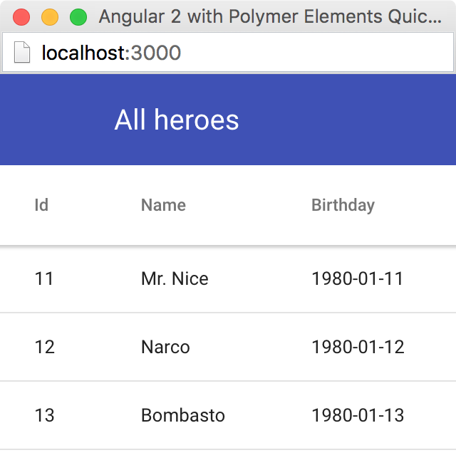

[[vaadin-angular2-polymer.tutorial.list-heroes]]
== List Heroes with Vaadin Grid

In the previous step, we added the application layout with [elementname]#app-layout# elements. Next, we are going add actual application content. Our plan is to use Vaadin Grid to list Heroes.

[NOTE]
.Some Parts are Explained in the Tour of Heroes
====
This step partly follows the Angular 2 Tour of Heroes Tutorial. Therefore, we skip explaining the parts of the code that are similar in both this tutorial and the Tour of Heroes, such as the [classname]#Hero# class and the [classname]#HeroService#.

See https://angular.io/docs/ts/latest/tutorial/[Tour of Heroes] for a detailed explaination of such similar parts.
====

=== Hero Class

Let us start by creating the [classname]#Hero# class. Create a [filename]#app/hero.ts# file with the following contents:

[source,typescript]
.[filename]#app/hero.ts#
----
export class Hero {
  id: number;
  name: string;
  birthday: string; // Using strings for simplicity
}
----

Unlike in Angular 2 Tour of Heroes, in our application we store and expose the birthday of each hero for the user. Here we add the `birthday: string;` property to our [classname]#Hero# class.

[NOTE]
.Using Strings to Store Dates
====
Why are we using the [classname]#string# type and not [classname]#Date# to store dates? There are two reasons:

. The built-in JavaScript [classname]#Date# type is always stored as a timestamp, so it always contains the exact time information. This is not only redundant, but also harder to use than a plain string in case of storing just a date. It requires extra care about the correct time and timezone when storing the value and displaying it to the user; otherwise we might get incorrect dates because of timezone mismatches.

. [vaadinelement]#vaadin-date-picker#, as well as native HTML5 `<input type="date">`, gives the date value as an ISO-formatted [classname]#string#. To preserve the simplicity in our application, we also store dates as strings, avoiding conversions.
====

=== Mock Heroes Data

Create a [filename]#app/mock-heroes.ts# file with some heroes data:

[source,typescript]
.[filename]#app/mock-heroes.ts#
----
import { Hero } from './hero';

export var HEROES: Hero[] = [
  { "id": 11,  "name": "Mr. Nice",   "birthday": "1980-01-11" },
  { "id": 12,  "name": "Narco",      "birthday": "1980-01-12" },
  { "id": 13,  "name": "Bombasto",   "birthday": "1980-01-13" },
  { "id": 14,  "name": "Celeritas",  "birthday": "1980-01-14" },
  { "id": 15,  "name": "Magneta",    "birthday": "1980-01-15" },
  { "id": 16,  "name": "RubberMan",  "birthday": "1980-01-16" },
  { "id": 17,  "name": "Dynama",     "birthday": "1980-01-17" },
  { "id": 18,  "name": "Dr IQ",      "birthday": "1980-01-18" },
  { "id": 19,  "name": "Magma",      "birthday": "1980-01-19" },
  { "id": 20,  "name": "Tornado",    "birthday": "1980-01-20" }
];
----

=== The Hero Service

We also need a [classname]#HeroService# to be able to retrive the heroes list in our Angular application. Create a [filename]#app/hero.service.ts# file:

[source,typescript]
.[filename]#app/hero.service.ts#
----
import { Injectable } from '@angular/core';

import { Hero } from './hero';
import { HEROES } from './mock-heroes';

@Injectable()
export class HeroService {
  getHeroes() {
    return Promise.resolve(HEROES);
  }
}
----

=== Heroes List Component

Add the heroes list component file [filename]#app/heroes.component.ts# with the following code:

[source,typescript]
.[filename]#app/heroes.component.ts#
----
import { Component, OnInit } from '@angular/core';

import { Hero } from './hero';
import { HeroService } from './hero.service';

@Component({
  selector: 'my-heroes',
  template: `
    <vaadin-grid [items]="heroes">
      <table>
        <colgroup>
          <col name="id">
          <col name="name">
          <col name="birthday">
        </colgroup>
      </table>
    </vaadin-grid>
  `,
  styles: [`
    vaadin-grid {
      height: 100%;
    }
  `]
})
export class HeroesComponent implements OnInit {
  heroes: Hero[];

  constructor(private _heroService: HeroService) { }

  getHeroes() {
    this._heroService.getHeroes().then(heroes => this.heroes = heroes);
  }

  ngOnInit() {
    this.getHeroes();
  }
}
----

Here in the [classname]#HeroesComponent#, we have the [vaadinelement]#vaadin-grid# element in the template. In the styles, we have a `height: 100%;` rule for the [vaadinelement]#vaadin-grid# element. In the template, there are three columns inside the [vaadinelement]#vaadin-grid#, specified with their corresponding item property names.

Also in the template, the [propertyname]#items# property of the [vaadinelement]#vaadin-grid# is bound to the [propertyname]#heroes# array property of [classname]#HeroesComponent#. At the same time, we import and use [classname]#HeroService# to get the list of heroes and assign the [propertyname]#heroes# property. Data binding of the Angular component takes care of updating the [propertyname]#items# property of [vaadinelement]#vaadin-grid# with the list of heroes for us.

=== Displaying Heroes List

Next, we need to edit the [filename]#app/app.component.ts# file to display the heroes list in the [classname]#AppComponent# template. Replace `
My application content
` with `<my-heroes></my-heroes>`, as in the following code:

[source,typescript]
.[filename]#app/app.component.ts#
----
import { Component } from '@angular/core';

@Component({
  selector: 'my-app',
  template: `
    <app-header-layout has-scrolling-region>
      <app-header fixed>
        <app-toolbar>
          
All heroes

        </app-toolbar>
      </app-header>
      <my-heroes></my-heroes>
    </app-header-layout>
  `,
  styles: [`
    app-toolbar {
      background: var(--primary-color);
      color: var(--dark-theme-text-color);
    }
  `]
})
export class AppComponent { }
----

=== Updating AppModule

Finally in this step, we update the [classname]#AppModule#. Change the contents of [filename]#app/app.module.ts# as follows:

[source,typescript]
.[filename]#app/app.module.ts#
----
import { NgModule, CUSTOM_ELEMENTS_SCHEMA } from '@angular/core';
import { PolymerModule, PolymerElement } from '@vaadin/angular2-polymer';

import { AppComponent }  from './app.component';
import { HeroService } from './hero.service';
import { HeroesComponent } from './heroes.component';

@NgModule({
  imports: [ PolymerModule ],
  declarations: [
    AppComponent,
    PolymerElement('app-header-layout'),
    PolymerElement('app-header'),
    PolymerElement('app-toolbar'),
    PolymerElement('paper-icon-button'),
    HeroesComponent,
    PolymerElement('vaadin-grid')
  ],
  providers: [ HeroService ],
  bootstrap: [ AppComponent ],
  schemas: [ CUSTOM_ELEMENTS_SCHEMA ]
})
export class AppModule { }
----

We did the following changes in the [filename]#app/app.module.ts# file:

* We imported [classname]#HeroService# and listed it in [propertyname]#providers#
* We also imported [classname]#HeroesComponent#, and appended it the [propertyname]#declarations#, alongside with the [classname]#PolymerElement# directives for the [vaadinelement]#vaadin-grid# element, which is used in the [classname]#HeroesComponent# template.

Now it is again time to look in the browser window, to see how the heroes list looks in our application. It should look about as in <<figure.vaadin-angular2-polymer.tutorial.heroes-list>>:

[[figure.vaadin-angular2-polymer.tutorial.heroes-list]]
.The list of heroes

